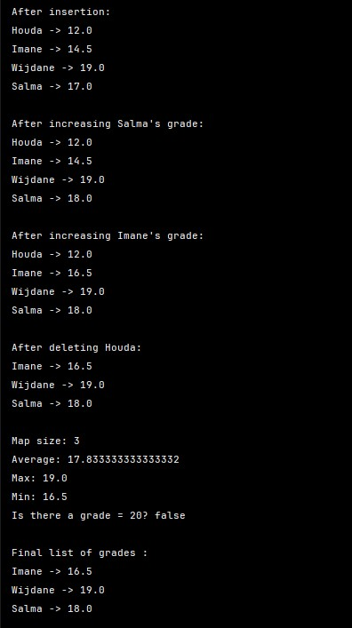
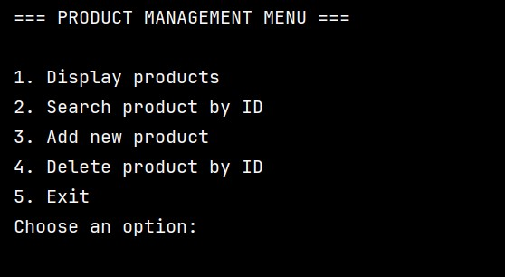

# TD2 Java – OOP, Collections & Generics

This repository contains all TD2 Java exercises.  
Each exercise includes a **problem description**, **solution explanation**, and **example output / screenshots **.

---

## Exercise 1 – Product List Management
**Problem:**  
Create a `Product` class and manage a list of products. Allow adding, deleting by index, modifying, displaying, and searching products by name.

**Solution:**  
- Created `Product.java` with attributes: `id`, `name`, `price`.  
- Used `ArrayList<Product>` to store products.  
- Implemented `ProductManagementApp.java` with menu options for:  
  - Adding new products  
  - Deleting products by index  
  - Modifying product information  
  - Displaying all products  
  - Searching products by name  

**Execution screenshot:**  

---

## Exercise 2 – Student Grades with Maps
**Problem:**  
Store and manage student grades using a `HashMap`. Support insertion, updates, deletion, size display, average, max/min calculation, and checking for specific grades.

**Solution:**  
- Created `Maps.java` using `HashMap<String, Double>`.  
- Added and updated grades using `put()`.  
- Removed grades using `remove()`.  
- Calculated average, maximum, and minimum using iteration.  
- Checked for a specific grade (e.g., 20).  
- Displayed all entries using `forEach` with lambda expressions.

**Execution screenshot:**  

---

## Exercise 3 – Student Groups with Sets
**Problem:**  
Manage two student groups using `HashSet` and display their union and intersection.

**Solution:**  
- Created `Sets.java` with `HashSet<String>` for `groupA` and `groupB`.  
- Added students to each group.  
- Calculated intersection using `retainAll()`.  
- Calculated union using `addAll()`.  

**Execution screenshot:**  

---

## Exercise 4 – Generic Storage Class
**Problem:**  
Create a reusable generic class `GenericStorage<T>` to store elements of any type. Perform add, remove, get, and size operations.

**Solution:**  
- Created `GenericStorage.java` with `List<T> elements`.  
- Methods implemented:  
  - `addElement(T o)`  
  - `removeElement(int index)`  
  - `getElement(int index)`  
  - `getSize()`  
- Tested in `Application.java` with types: `Integer`, `String`, and `Double`.

**Execution screenshot:**  

---

## Exercise 5 – Product Management with Generics
**Problem:**  
Use generics to manage a list of `Product` objects. Support add, delete, find by ID, and display all products via a menu-driven program.

**Solution:**  
- Extended `Product.java` with attributes: `id`, `name`, `brand`, `price`, `description`, `numberInStock`.  
- Created `IMetier<T>` generic interface with methods:  
  - `add(T o)`  
  - `getAll()`  
  - `findById(long id)`  
  - `delete(long id)`  
- Implemented `MetierProduitImpl.java` to manage `List<Product>`.  
- Menu implemented in `Application.java` with options:  
  1. Display all products  
  2. Search by ID  
  3. Add product  
  4. Delete product by ID  
  5. Exit program

**Execution screenshot:**  

---

## 🛠️ Tools & Concepts Used
- Java 25.0.1  
- Object-Oriented Programming: classes, constructors, getters/setters  
- Collections: `ArrayList`, `HashMap`, `HashSet`  
- Generics: generic classes and interfaces  
- Lambda expressions and `forEach`  
- Menu-driven console applications  
- CRUD operations

---

## 📂 Repository Structure

| File | Description |
|------|-------------|
| `Application.java` | Main driver for generic storage and product menu |
| `GenericStorage.java` | Generic storage class |
| `Product.java` | Product class with attributes and constructors |
| `ProductManagementApp.java` | Basic list CRUD operations |
| `IMetier.java` | Generic interface for product management |
| `MetierProduitImpl.java` | Implementation of `IMetier<Product>` |
| `Maps.java` | Demonstrates `HashMap` usage with grades |
| `Sets.java` | Demonstrates `HashSet` usage with groups |

---

